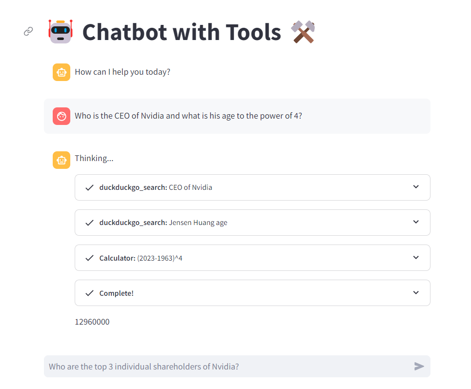

# GPT with Tools
This project is a chatbot application leveraging LangChain's capabilities along with the Streamlit framework. With LangChain's tools such as internet browsing and a calculator, this chatbot provides intelligent responses to user queries, making it a versatile tool for various tasks. 

## Features

- **LangChain Integration**: Harnesses LangChain's features, including internet browsing and a calculator, to provide comprehensive responses.
- **Streamlit Interface**: Utilizes the Streamlit framework for a user-friendly and interactive chatbot interface.
- **Customizable Tools**: Easily extendable with additional tools and functionalities to suit specific use cases.
- **OpenAI Integration**: Seamlessly integrates with OpenAI for advanced natural language processing capabilities.

## Installation

1. Clone this repository to your local machine.
2. Install dependencies by running: `pip install -r requirements.txt`

## Usage

1. Run the application by executing: `streamlit run llm_agent_app.py`
2. Enter your OpenAI API key in the sidebar.
3. Interact with the chatbot by typing queries or commands in the input field.

